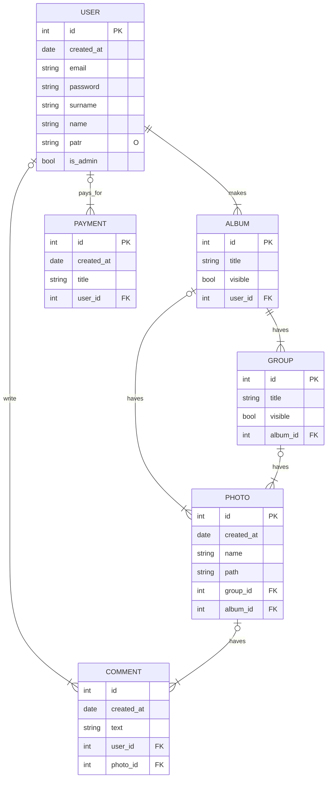

# Wedding Me (backend)


## Общее описание
_____

### Стек технологий:
  - FastAPI;
  - postgreSQL;
  - docker;
  - docker-compose.


## Техническое описание
_____

### ER-Diagrams


### fastapi
```bash
# запустить сервер
$ uvicorn --factory src.main:create_app --reload
```

### команды MakeFile
```bash
# запустить контейнер с приложением
$ make app
# запустить контейнер с приложением
$ make storage
```

### docker & docker-compose
```bash
# собрать
$ docker compose -f docker_compose/app.yaml up
# ребилдинг
$ docker build --no-cache -t docker_compose-fastapi .
```

### PipENV
```bash
# install pipenv
pip install pipenv
# .venv in fold of the project
$env:PIPENV_VENV_IN_PROJECT=1
# initilization
pipenv shell
# install
pipenv install
```


## Ссылки
_____
[by Yamemik](https://github.com/Yamemik)
[ТЗ](https://docs.google.com/document/d/1KUIepvxzV8rNgzTm7u0jYfLznHQ3HfmMgL96vpWOmVI/edit?usp=sharing)
[ERD](https://www.mermaidchart.com/app/projects/fd09ee93-1435-4b78-923e-98d85a854631/diagrams/69b97eb7-3f73-4452-89ae-ade46339f9f9/version/v0.1/edit)
